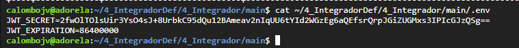
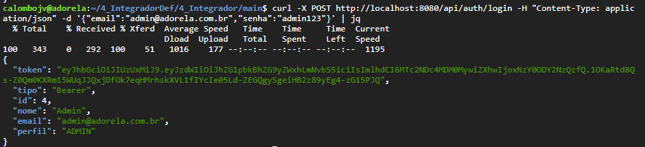
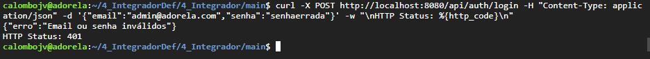
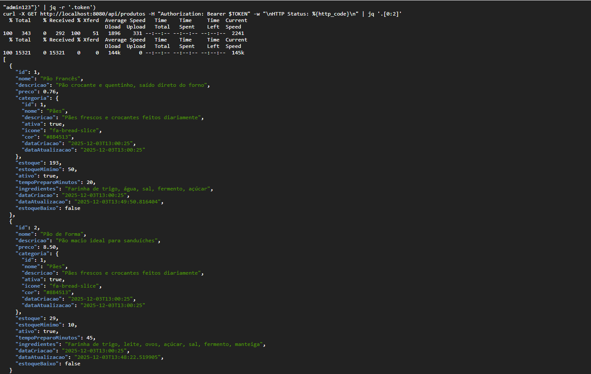
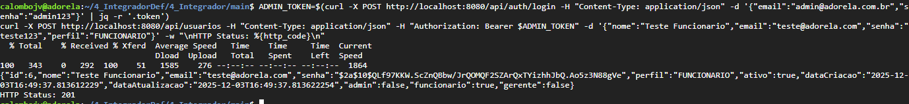
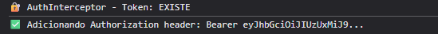

As senhas no banco de dados devem estar criptografadas: Avalia se as senhas dos usuarios estao armazenadas no banco de dados usando um hash forte (BCrypt), e nao em texto plano:

Arquivo: 4_Integrador/main/src/main/java/app/projeto/config/SecurityConfig.java
@Bean
public PasswordEncoder passwordEncoder() {
    return new BCryptPasswordEncoder();
}

---

O segredo do JWT deve estar em um arquivo .env: Verifica se chaves sensiveis (como o segredo do JWT) estao externalizadas em arquivos de configuracao e nao escritas diretamente no codigo ("hardcoded").

Arquivo: 4_Integrador/main/src/main/java/app/projeto/config/JwtUtil.java
public JwtUtil() {
    Dotenv dotenv = Dotenv.configure()
            .directory(".")
            .ignoreIfMissing()
            .load();
    
    this.jwtSecret = dotenv.get("JWT_SECRET", "adorela-panificadora-secret-key-super-segura-2024-mudar-em-producao");
    this.jwtExpiration = Long.parseLong(dotenv.get("JWT_EXPIRATION", "86400000"));
    this.key = Keys.hmacShaKeyFor(jwtSecret.getBytes(StandardCharsets.UTF_8));
}

---

O endpoint de login funciona...: Confirma se a API possui um endpoint de autenticacao que recebe credenciais, valida-as corretamente e retorna um token JWT valido em caso de sucesso.

Arquivo: 4_Integrador/main/src/main/java/app/projeto/controller/AuthController.java
@PostMapping("/login")
public ResponseEntity<?> login(@Valid @RequestBody LoginRequest loginRequest) {
    try {
        Authentication authentication = authenticationManager.authenticate(
            new UsernamePasswordAuthenticationToken(
                loginRequest.getEmail(),
                loginRequest.getSenha()
            )
        );
        
        SecurityContextHolder.getContext().setAuthentication(authentication);
        String jwt = jwtUtil.gerarToken(loginRequest.getEmail());
        Usuario usuario = customUserDetailsService.carregarUsuarioPorEmail(loginRequest.getEmail());
        
        LoginResponse response = new LoginResponse(
            jwt,
            usuario.getId(),
            usuario.getNome(),
            usuario.getEmail(),
            usuario.getPerfil()
        );

        return ResponseEntity.ok(response);
    } catch (AuthenticationException e) {
        return ResponseEntity
            .status(HttpStatus.UNAUTHORIZED)
            .body(Map.of("erro", "Email ou senha invalidos"));
    }
}

---

O Spring Security esta configurado para bloquear...: Analisa se os filtros do Spring Security estao corretamente configurados para interceptar requisicoes, validar o token JWT e bloquear o acesso a rotas protegidas.

Arquivo: 4_Integrador/main/src/main/java/app/projeto/config/SecurityConfig.java
@Bean
public SecurityFilterChain filterChain(HttpSecurity http) throws Exception {
    http
        .csrf(csrf -> csrf.disable())
        .sessionManagement(session -> session.sessionCreationPolicy(SessionCreationPolicy.STATELESS))
        .authorizeHttpRequests(authz -> authz
            .requestMatchers("/api/auth/**").permitAll()
            .requestMatchers("/api/**").authenticated()
        )
        .addFilterBefore(jwtAuthenticationFilter, UsernamePasswordAuthenticationFilter.class);
    return http.build();
}

Arquivo: 4_Integrador/main/src/main/java/app/projeto/security/JwtAuthenticationFilter.java
@Override
protected void doFilterInternal(HttpServletRequest request, HttpServletResponse response, FilterChain filterChain) throws ServletException, IOException {
    try {
        String jwt = getJwtFromRequest(request);
        if (StringUtils.hasText(jwt) && jwtUtil.validarToken(jwt)) {
            String email = jwtUtil.getEmailDoToken(jwt);
            UserDetails userDetails = customUserDetailsService.loadUserByUsername(email);
            UsernamePasswordAuthenticationToken authentication = 
                new UsernamePasswordAuthenticationToken(userDetails, null, userDetails.getAuthorities());
            authentication.setDetails(new WebAuthenticationDetailsSource().buildDetails(request));
            SecurityContextHolder.getContext().setAuthentication(authentication);
        }
    } catch (Exception e) {
        logger.error("Nao foi possivel definir a autenticacao do usuario", e);
    }
    filterChain.doFilter(request, response);
}

---

Rotas que exigem perfis especificos...: Verifica a implementacao da autorizacao baseada em papeis (Roles), garantindo que um usuario (ex: ROLE_FUNCIONARIO) nao possa acessar rotas de ROLE_ADMIN.

Arquivo: 4_Integrador/main/src/main/java/app/projeto/config/SecurityConfig.java
.authorizeHttpRequests(authz -> authz
    .requestMatchers(HttpMethod.POST, "/api/usuarios").hasRole("ADMIN")
    .requestMatchers(HttpMethod.DELETE, "/api/usuarios/**").hasRole("ADMIN")
    .requestMatchers(HttpMethod.PUT, "/api/usuarios/**").hasAnyRole("ADMIN", "GERENTE")
    .requestMatchers(HttpMethod.POST, "/api/produtos").hasAnyRole("ADMIN", "GERENTE")
    .requestMatchers(HttpMethod.PUT, "/api/produtos/**").hasAnyRole("ADMIN", "GERENTE")
    .requestMatchers(HttpMethod.DELETE, "/api/produtos/**").hasAnyRole("ADMIN", "GERENTE")
    .requestMatchers(HttpMethod.POST, "/api/categorias").hasAnyRole("ADMIN", "GERENTE")
    .requestMatchers(HttpMethod.PUT, "/api/categorias/**").hasAnyRole("ADMIN", "GERENTE")
    .requestMatchers(HttpMethod.DELETE, "/api/categorias/**").hasAnyRole("ADMIN", "GERENTE")
    .requestMatchers("/api/**").authenticated()
)

---

O Angular utiliza CanActivate...: Confirma se o front-end possui guardas de rota (CanActivate) que impedem o acesso a paginas protegidas colando a URL diretamente no navegador.

Arquivo: 4_Integrador/vagas-frontend/src/app/guards/auth.guard.ts
@Injectable({
  providedIn: 'root'
})
export class AuthGuard implements CanActivate {
  constructor(
    private authService: AuthService,
    private router: Router
  ) {}

  canActivate(route: ActivatedRouteSnapshot, state: RouterStateSnapshot): boolean {
    if (this.authService.isAutenticado()) {
      const perfisRequeridos = route.data['perfis'] as string[];
      if (perfisRequeridos && perfisRequeridos.length > 0) {
        if (this.authService.temAlgumPerfil(perfisRequeridos)) {
          return true;
        } else {
          this.router.navigate(['/dashboard']);
          return false;
        }
      }
      return true;
    }
    this.router.navigate(['/login'], { queryParams: { returnUrl: state.url } });
    return false;
  }
}

Arquivo: 4_Integrador/vagas-frontend/src/app/app.routes.ts
export const routes: Routes = [
  { path: '', component: HomeComponent },
  { path: 'login', component: LoginComponent },
  {
    path: 'app',
    component: LayoutComponent,
    canActivate: [AuthGuard],
    children: [
      { path: 'dashboard', component: DashboardComponent },
      { 
        path: 'usuarios/novo', 
        component: UsuarioFormComponent,
        canActivate: [AuthGuard],
        data: { perfis: ['ADMIN'] }
      },
      { 
        path: 'usuarios/editar/:id', 
        component: UsuarioFormComponent,
        canActivate: [AuthGuard],
        data: { perfis: ['ADMIN', 'GERENTE'] }
      },
      { 
        path: 'produtos/novo', 
        component: ProdutoFormComponent,
        canActivate: [AuthGuard],
        data: { perfis: ['ADMIN', 'GERENTE'] }
      },
      { 
        path: 'pedidos', 
        component: PedidoListComponent
      },
    ]
  }
];

---

Utiliza um HttpInterceptor...: Avalia se um interceptor HTTP foi implementado para anexar o token Bearer automaticamente em todas as chamadas para a API.

Arquivo: 4_Integrador/vagas-frontend/src/app/interceptors/auth.interceptor.ts
export const authInterceptor: HttpInterceptorFn = (request, next) => {
  const authService = inject(AuthService);
  const router = inject(Router);
  const platformId = inject(PLATFORM_ID);
  const isBrowser = isPlatformBrowser(platformId);

  if (!isBrowser) {
    return next(request);
  }

  const token = authService.getToken();

  if (token) {
    request = request.clone({
      setHeaders: {
        Authorization: `Bearer ${token}`
      }
    });
  }

  return next(request).pipe(
    catchError((error: HttpErrorResponse) => {
      if (error.status === 401) {
        authService.logout();
      }
      if (error.status === 403) {
        router.navigate(['/dashboard']);
      }
      return throwError(() => error);
    })
  );
};

Arquivo: 4_Integrador/vagas-frontend/src/app/app.config.ts
export const appConfig: ApplicationConfig = {
  providers: [
    provideHttpClient(
      withInterceptors([authInterceptor]),
      withFetch()
    ),
    ...
  ]
};

